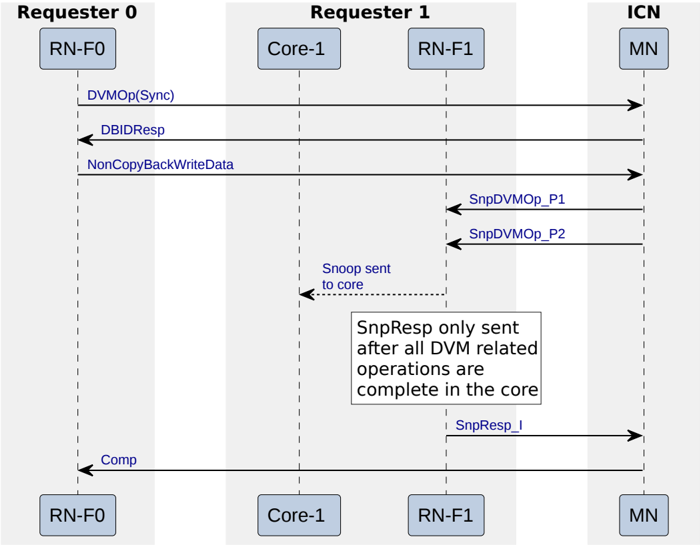

The required steps that Figure B8.2 shows are:

1. RN-F0 sends a DVMOp(Sync) to the Miscellaneous Node.

    > **_NOTE:_** All previous DVMOp requests whose completion needs to be guaranteed by the DVMOp(Sync) must have received a Comp response before the Request Node can send a DVMOp(Sync).

2. The Miscellaneous Node accepts the DVMOp(Sync) request and sends a DBIDResp response to the Requester.
3. The RN-F0 sends a data packet on the data channel with a data size of 8 bytes.
4. The Miscellaneous Node sends the SnpDVMOp to RN-F1. The SnpDVMOp is sent on the Snoop channel, and requires two Snoop requests. The two parts of a SnpDVMOp are labeled by the suffix \_P1 and \_P2.
5. After completing the DVM Sync operation, RN-F1 sends a SnpResp response to the Miscellaneous Node.

    > **_NOTE:_** Sending of a SnpResp implies that all DVM-related operations have completed at the Request Node structures and the target Request Node has freed up the resources needed to accept another SnpDVMOp.

6. After receiving the SnpResp, the Miscellaneous Node sends a Comp response to RN-F0.