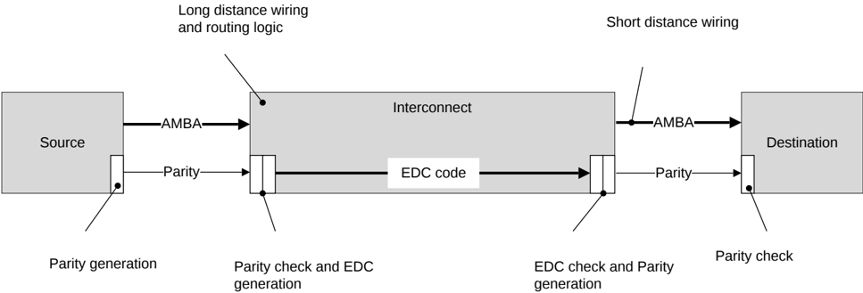

## B9.3 Use of interface parity

For safety-critical applications, it is necessary to detect and possibly correct, transient and functional errors on individual wires within an SoC.

An error in a system component can propagate and cause multiple errors within connected components. Error Detection and Correction (EDC) is required to operate end-to-end, covering all logic and wires from source to destination.

One way to implement end-to-end protection, is to employ customized EDC schemes in components and implement a simple error detection scheme between components. Between these components there is no logic and connections are relatively short. This section describes a parity scheme for detecting single-bit errors on the interface between components. Multi-bit errors can be detected if they occur in different parity signal groups.

Figure B9.1 shows locations where parity can be used.

Figure B9.1: Parity use in AMBA

AMBA parity optionally extends the error detection provided on the DAT channel by the DataCheck field to cover the complete flit and control signals on all channels. The protection scheme employed on an interface is defined by the property Check\_Type. See B16.1 Interface properties and parameters.

### B9.3.1 Byte parity check signals

The following attributes are common to all the check signals added for byte parity interface protection:

- Odd parity is used. Odd parity means that check signals are added to groups of signals on the interface and driven such that there is always an odd number of asserted bits in that group.
- Parity signals covering data and payload are defined such that there are no more than 8 bits per group. This limitation assumes that there is a maximum of 3 logic levels available in the timing budget for generating each parity bit.
- Parity signals covering critical control signals, which are likely to have a smaller timing budget available, are defined with a single odd parity bit.
- The least significant check bit of the check signal covers the least significant byte of payload.
- If the bits in a payload do not fill the most significant byte, the most significant bit of the check signal covers fewer than 8 bits.