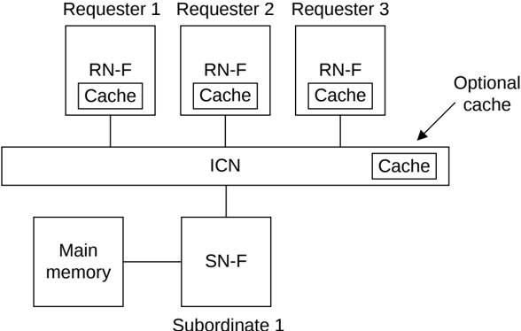

## B1.5 Coherence overview

Hardware coherency enables system components to share memory without the requirement of software cache maintenance to maintain coherency.

Regions of memory are coherent if writes to the same memory location by two components are observable in the same order by all components.

### B1.5.1 Coherency model

Figure B1.2 shows an example coherent system that includes three Requester components, each with a local cache and coherent protocol node. The protocol permits cached copies of the same memory location to reside in the local cache of one or more Requester components.

Figure B1.2: Example coherency model

The coherence protocol enforces that no more than one copy of a data value exists whenever a store occurs at an address location. The coherence protocol ensures all Requesters observe the correct data value at any given address location. After each store to a location, other Requesters can obtain a new copy of the data for their own local cache to permit multiple cached copies to exist.

A cache line is defined as a 64-byte aligned memory region. All coherency is maintained at cache line granularity.

Main memory is only required to be updated before a copy of the memory location is no longer held in any cache. The coherence protocol does not require main memory to be up to date at all times.

> **_NOTE:_**  Although not a requirement, it is permitted to update main memory while cached copies still exist.

The coherence protocol enables Requester components to determine whether a cache line is the only copy of a particular memory location or if other copies of the same location exist. The coherence protocol ensures:

- If a cache line is the only copy, a Requester component can change the value of the cache line without notifying any other Requester components in the system.
- If a cache line can also be present in another cache, a Requester component must notify the other caches using an appropriate transaction.