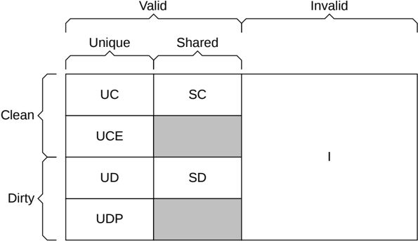

### B1.5.2 Cache state model

When a component accesses a cache line, the protocol defines cache states to determine whether an action is required. Each cache state is based on the following cache line characteristics:

**Valid, Invalid**

When Valid, the cache line is present in the cache.

When Invalid, the cache line is not present in the cache.

**Unique, Shared**

When Unique, the cache line exists only in the Unique cache.

When Shared, the cache line can exist in more than one cache. The cache line is not guaranteed to exist in more than once cache.

**Clean, Dirty**

When Clean, the cache does not have responsibility for updating main memory.

When Dirty, the cache line has been modified with respect to main memory. The Dirty cache must ensure that main memory is eventually updated.

**Full, Partial, Empty**

A Full cache line has all bytes valid.

A Partial cache line can have some bytes valid, where some include none or all bytes.

An Empty cache line has no bytes valid.

Figure B1.3 shows the seven state cache model. B4.1 Cache line states gives further information about each cache state.

A valid cache state name that is not Partial or Empty is considered to be Full. In Figure B1.3, UC, UD, SC, and SD are all Full cache line states.

Figure B1.3: Cache state model

