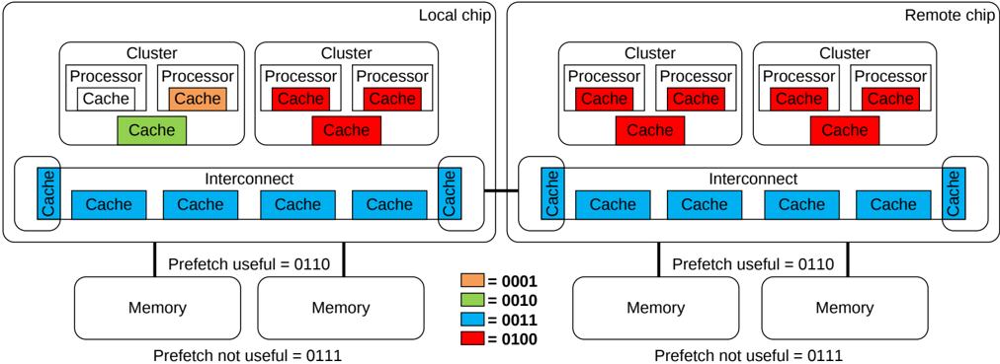

Figure B11.1: Suggested DataSource[3:0] values

### B11.2.3 Example use cases

Two examples of how DataSource information can be used by a Requester are:

- To determine the usefulness of a PrefetchTgt transaction in initiating a memory controller prefetch.

    - By monitoring the DataSource value in the data returned from the memory SN-F, the Requester can determine the usefulness of sending PrefetchTgt requests and can modulate the rate, and the sending, of PrefetchTgt requests.

- Can be used by performance profiling and debug software to evaluate and optimize the data sharing pattern.