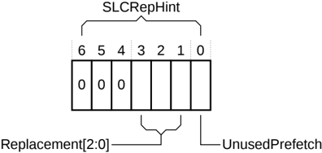

## B11.3 SLC Replacement Hint

The purpose of this feature is to forward cache replacement hints from the Requesters to the caches in the interconnect, the System Level Caches (SLC). Typically, a Request Node has the best knowledge of the utility of a cache line. An SLC that is informed of this knowledge can use it to bias its own replacement algorithms and manage cache line replacement in a more efficient manner.

### B11.3.1 Characteristics

Although the replacement information is most useful in CopyBack requests, SLC is not restricted to CopyBack transactions. SLCRepHint is extended to all requests from the Request Node to HN-F, except for the following:

- Atomics
- Stash transactions when StashNIDValid is 1
- PrefetchTgt
- PCrdReturn
- DVMOp

This feature is supported by a 7-bit field called SLCRepHint that is included in the REQ channel. SLCRepHint includes two subfields, a 3-bit Replacement field and a 1-bit UnusedPrefetch field.

Figure B11.2 shows the placement of the SLCRepHint subfields.

Figure B11.2: SLCRepHint subfield placement

The SLCRepHint field shares the same REQ packet location as ReturnNID and StashNID. When the node ID widths are greater than 7 bits and the field is used as SLCRepHint, the unused bits of the shared field must be set to 0.

Table B11.2 shows the encoding of the UnusedPrefetch subfield.

Table B11.2: UnusedPrefetch subfield encoding

| UnusedPrefetch | Description                                              |
|----------------|----------------------------------------------------------|
| 0              | The cache line could have been used since being fetched. |
| 1              | The cache line was not used since being fetched.         |

> **_NOTE:_** A Request Node that does not track the usage of the cache line can set the UnusedPrefetch bit value to 0.