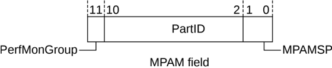

## B11.4 MPAM

Memory System Resource Partioning and Monitoring (MPAM) is a mechanism to efficiently utilize the memory resources among users and to monitor the utilization of those resources. The resources are partitioned among users by Partition Identifier (PartID) and Performance Monitoring Group (PerfMonGroup). A Requester that supports MPAM includes a label within each sent request, identifying the partition to which the request belongs, together with the performance monitoring group within that partition. The Home or the Subordinate uses this information to allocate their resources to this request. Support for MPAM on an interface is defined by the MPAM\_Support property. See B16.1.9 MPAM\_Support.

The MPAM field is applicable only in the REQ and SNP channels:

- On the REQ channel, when a sender does not want to use MPAM for a request, the MPAM values must be set to default settings. See Table B11.5.
- On the SNP channel, MPAM values are only applicable in Stash snoops. In Non-stash type snoops, MPAM values are inapplicable and must be set to default values.

Field width is either 0 bits or 12 bits:

- The width is 0 bits on interfaces that do not support MPAM.
- When the MPAM\_Support property is MPAM\_9\_1, the MPAM field width is 12 bits. The field is further divided into the subfields:

    - PartID = 9 bits
    - PerfMonGroup = 1 bit
    - MPAMSP = 2 bits

Figure B11.3 shows the allocation of the MPAM field bits.

Figure B11.3: MPAM subfields bit allocation

It is IMPLEMENTATION DEFINED how the Receiver uses the MPAM field values.

### B11.4.1 MPAMSP

MPAMSP provides the partition identifier namespace selector.

Table B11.4 shows the MPAMSP encodings.

Table B11.4: MPAMSP encodings

| MPAMSP | Partition description |
|--------|-----------------------|
| 00     | Secure                |
| 01     | Non-secure            |
| 10     | Root                  |
| 11     | Realm                 |