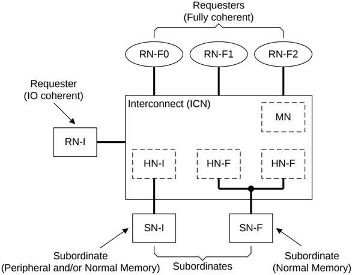

**SN**

Subordinate Node. Receives a request from a Home Node, completes the required action, and returns a response. A Subordinate Node is further categorized as:

- **SN-F** Subordinate Node.

    - Used for Normal memory.
    - Can process Non-snoopable Read, Write, and Atomic requests, including exclusive variants of them, and Cache Maintenance Operation (CMO) requests.

- **SN-I** Subordinate Node.

    - Used for peripherals or Normal memory.
    - Can process Non-snoopable Read, Write, and Atomic requests, including exclusive variants of them, and CMO requests.

Figure B1.4 shows various protocol node types connected through an interconnect.

Figure B1.4: Protocol node examples

