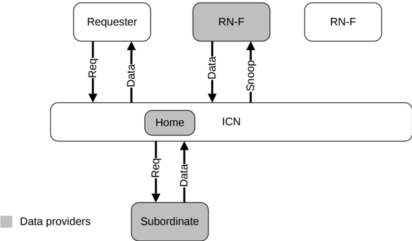

## B1.7 Read data source

In a CHI-based system, a Read request can obtain data from different sources. Figure B1.5 shows that these sources are:

- Cache within the interconnect
- Subordinate Node
- Peer RN-F

Figure B1.5: Possible Data providers for a Read request

One option for the Home is to request that the RN-F or Subordinate Node returns data only to Home. The Home, in turn, forwards a copy of the received data to the Requester. A hop in obtaining Data in the Read transaction flow can be removed if the Data provider is enabled to forward the Data response directly to the Requester instead of via the Home.

Several techniques can be used to reduce the number of hops to complete a transaction. The reduction in the number of hops results in Read and Write latency savings and interconnect bandwidth utilization. The techniques are categorized as:

**Direct Memory Transfer (DMT)**

Defines the feature that permits the Subordinate Node to send data directly to the Requester.

**Direct Cache Transfer (DCT)**

Defines the feature which permits a peer RN-F to send data directly to the Requester. The Data provider in the DCT Read transaction flows has to inform the Home that Data has been sent to the Requester. In some cases, the Data provider also has to send a copy of data to the Home.

**Direct Write-data Transfer (DWT)**

Defines the feature which permits the requesting Request Node to send write data directly to the Subordinate Node.