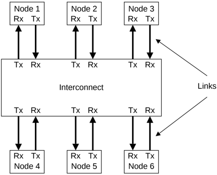

## B13.1 Introduction

The Link layer provides a streamlined mechanism for packet-based communication between nodes and the interconnect.

The Link layer defines packet and flit formats, and flow control across a link.

Figure B13.1 shows a typical system using link-based communication.

Figure B13.1: System using link-based communication

Interface parity signals, which are discussed in B9.3 Use of interface parity are not included in this chapter.