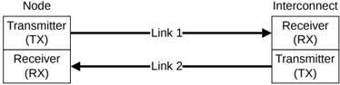
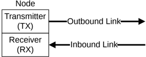

## B13.2 Link

Flit communication occurs between a Transmitter and a Receiver pair.

The connection between a Transmitter and a Receiver is referred to as a link.

Two-way communication between a node and the interconnect requires a pair of links.

Figure B13.2 shows the link requirements.

Figure B13.2: Two-way link communication

### B13.2.1 Outbound and inbound links

The link used by a Transmitter to send packets is defined as the outbound link.

The link used by a Receiver to receive packets is defined as the inbound link.

Figure B13.3 shows the outbound and inbound links at a node. The interface at the interconnect has a complementary pair of links.

Figure B13.3: Outbound and inbound links

