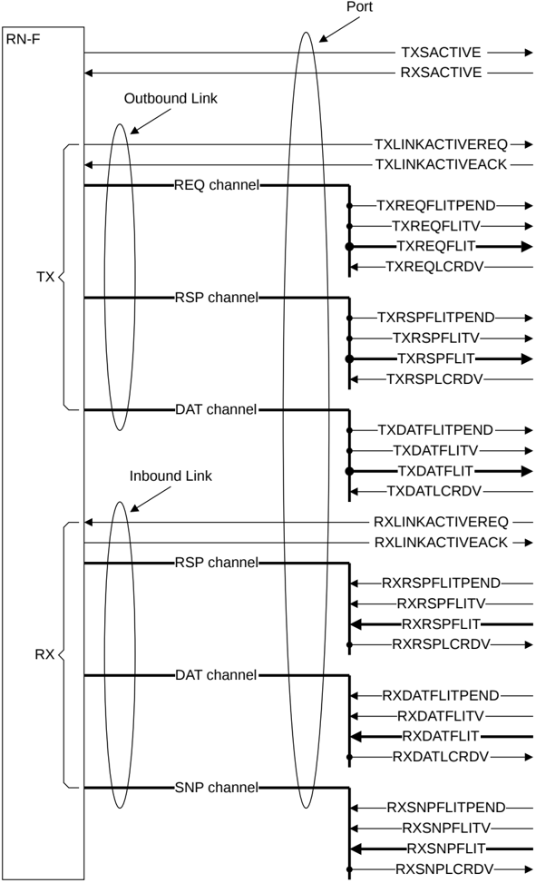

## B13.5 Port

A Port is defined as the set of all links at the interface of a node.

Figure B13.4 shows the relationship between links, channels, and port. See B13.6 Node interface defintions for the specific node requirements. See B13.8 Channel interface signals, and Chapter B14 Link Handshake for signal details.

Figure B13.4: Relationship between links, channels, and ports

