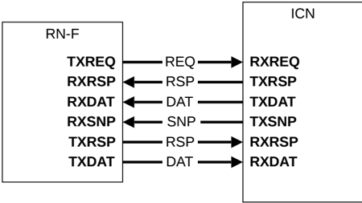

## B13.6 Node interface defintions

The nodes exchange messages by sending flits across the node interface. This section describes two node types of node interfaces supported by the CHI protocol:

- B13.6.1 Request Nodes
- B13.6.2 Subordinate Nodes

> **_NOTE:_** The LINKACTIVE interface pins and signals used by each node for link management are described in Chapter B14 Link Handshake.

### B13.6.1 Request Nodes

This section describes the Request Node interfaces:

- B13.6.1.1 RN-F
- B13.6.1.2 RN-D
- B13.6.1.3 RN-I

#### B13.6.1.1 RN-F

The RN-F interface uses all channels and is used by a fully coherent Requester such as a core or cluster.

Figure B13.5 shows the RN-F interface.

Figure B13.5: RN-F interface

#### B13.6.1.2 RN-D

The RN-D interface uses all channels and is used by an IO coherent node that processes DVM messages. Use of the SNP channel is limited to DVM transactions. See B8.2 DVM transaction flow for details.

Figure B13.6 shows the RN-D interface.