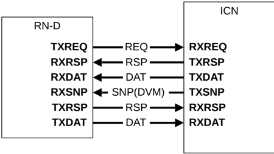
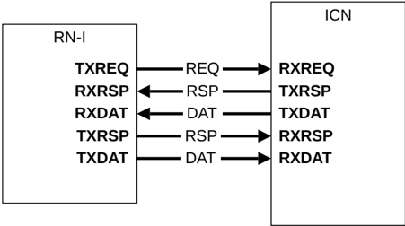

Figure B13.6: RN-D interface

## B13.6.1.3 RN-I

The RN-I interface uses all channels, with the exception of the SNP channel, and is used by an IO coherent Request Node such as a GPU or IO bridge. A SNP channel is not required because an RN-I node does not include a hardware-coherent cache or TLB.

Figure B13.7 shows the RN-I interface.

Figure B13.7: RN-I interface

### B13.6.2 Subordinate Nodes

This section describes the Subordinate Node interfaces:

- B13.6.2.1 SN-F and SN-I

#### B13.6.2.1 SN-F and SN-I

The SN-F and SN-I interfaces are identical and use a RX request channel, a TX response channel, a TX data channel, and an RX data channel. The SN-F and SN-I receive request messages from the interconnect, and return response messages to the interconnect. However, the SN-F and SN-I receive different types of transactions.

Figure B13.8 shows the SN-F and SN-I interface.
