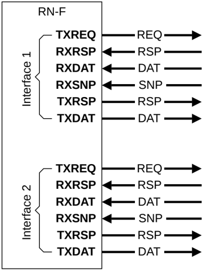

## B13.7 Increasing inter-port bandwidth

The available bandwidth at a node interface can be increased in several ways. Two architectural methods permitted are detailed in the following sections:

- B13.7.1 Multiple interfaces
- B13.7.2 Replicated channels on a single interface

### B13.7.1 Multiple interfaces

The simplest method for a component to increase the available bandwidth is to have multiple interfaces. A complete interface can be duplicated. The number of times an interface on a node is duplicated is IMPLEMENTATION DEFINED.

Figure B13.9 shows an example of duplicated interfaces.

Figure B13.9: Multiple interface example

The main features of this method of increasing bandwidth across two interfaces are:

- Each interface has its own:

    - NodeID
    - TxnID pool
    - Set of **SACTIVE** signals
    - Set of **LINKACTIVE** signals
    - Set of **SYSCOREQ**/**SYSCOACK** signals
    - Set of optional broadcast control pins

- Each duplicate interface must be treated as an independent interface:

    - If one interface allocates the cache line, another duplicate interface cannot deallocate that cache line.