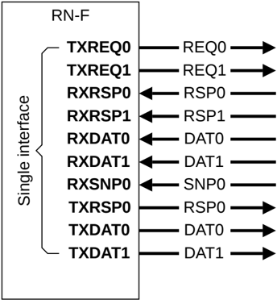

### B13.7.2 Replicated channels on a single interface

Rather than replicating a complete interface through more complex methods, a more efficient method to increase the available interface bandwidth is to selectively replicate the channels that require greater bandwidth.

Figure B13.10 shows an example of replicated channels.

Figure B13.10: Replicated channels example

#### B13.7.2.1 Features

The main features of this method of increasing available bandwidth are described in this section.

Each channel can be selectively replicated. There are no restrictions on which channels are replicated. Typically, replication of a channel is based on the expected bandwidth required on that channel. For example, in Figure B13.10, TXREQ is duplicated as TXREQ0, TXREQ1, whereas RXSNP is not duplicated and has only RXSNP0. The characteristics of the replicated channel interface are:

- All replicated DAT subchannels corresponding to a single DAT channel must be of the same width.
- The complete interface must use:

    - The same NodeID
    - A single TxnID pool

- Messages within a transaction can use any subchannel:

    - A response message does not need to use the same subchannel as the request. For example, Request on TXREQ0 can give a response on either RXRSP0 or RXRSP1.
    - Multiple response messages for a single request can come on any subchannel. For example, DBIDResp for a write transaction is received on RXRSP0 whereas the corresponding Comp can be received on RXRSP1.

- Like non-replicated channels, replicated channels do not provide any in-channel ordering guarantees.
- All link crediting is done on a subchannel basis.

    - Cannot use the credit for TXREQ0 to send the flit on TXREQ1.
    - Credits are required to be provided by the Receiver on all subchannels.