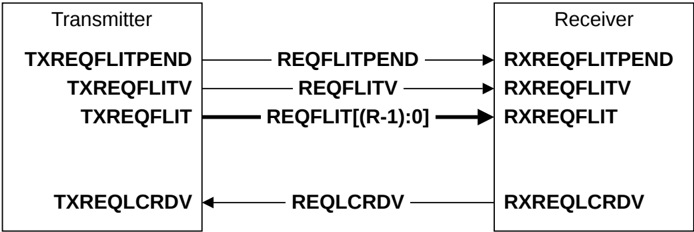

## B13.8 Channel interface signals

This section describes the channel interface signals. It contains the following sections:

- B13.8.1 Request, REQ, channel
- B13.8.2 Response, RSP, channel
- B13.8.3 Snoop, SNP, channel
- B13.8.4 Data, DAT, channel

### B13.8.1 Request, REQ, channel

Figure B13.11 shows the REQ channel interface pins, where R is the width of REQFLIT.

Figure B13.11: REQ channel interface pins

Table B13.2 shows the REQ channel interface signals.

Table B13.2: REQ channel interface signals

| Signal           | Description                                                                                                                                          |
|------------------|------------------------------------------------------------------------------------------------------------------------------------------------------|
| REQFLITPEND      | Request Flit Pending. Early indication that a request flit could be transmitted in the following cycle. See B14.4 Flit level clock gating.           |
| REQFLITV         | Request Flit Valid. The transmitter sets this signal HIGH to indicate when REQFLIT[(R-1):0] is valid.                                                |
| REQFLIT[(R-1):0] | Request Flit. See B13.9.1 Request flit for a description of the request flit format.                                                                 |
| REQLCRDV         | Request L-Credit Valid. The receiver sets this signal HIGH to return a request channel L-Credit to a transmitter. See B14.2.1 L-Credit flow control. |

### B13.8.2 Response, RSP, channel

Figure B13.12 shows the RSP channel interface pins, where T is the width of RSPFLIT. The same interface is used for both inbound and outbound RSP channels.