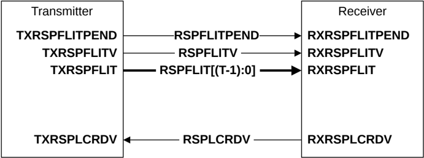

Figure B13.12: RSP channel interface pins

Table B13.3 shows the RSP channel interface signals.

Table B13.3: RSP channel interface signals

| Signal           | Description                                                                                                                                            |
|------------------|--------------------------------------------------------------------------------------------------------------------------------------------------------|
| RSPFLITPEND      | Response Flit Pending. Early indication that a response flit could be transmitted in the following cycle. See B14.4 Flit level clock gating.           |
| RSPFLITV         | Response Flit Valid. The transmitter sets this signal HIGH to indicate when RSPFLIT[(T-1):0] is valid.                                                 |
| RSPFLIT[(T-1):0] | Response Flit. See B13.9.2 Response flit for a description of the response flit format.                                                                |
| RSPLCRDV         | Response L-Credit Valid. The receiver sets this signal HIGH to return a response channel L-Credit to a transmitter. See B14.2.1 L-Credit flow control. |

### B13.8.3 Snoop, SNP, channel

Figure B13.13 shows the SNP channel interface pins, where S is the width of SNPFLIT.