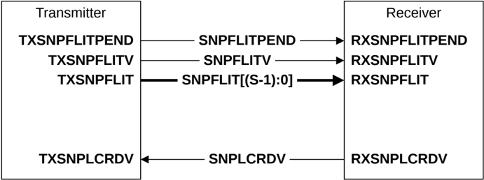

Figure B13.13: SNP channel interface pins

Table B13.4 shows the SNP channel interface signals.

Table B13.4: SNP channel interface signals

| Signal           | Description                                                                                                                                      |
|------------------|--------------------------------------------------------------------------------------------------------------------------------------------------|
| SNPFLITPEND      | Snoop Flit Pending. Early indication that a snoop flit could be transmitted in the following cycle. See B14.4 Flit level clock gating.           |
| SNPFLITV         | Snoop Flit Valid. The transmitter sets this signal HIGH to indicate when SNPFLIT[(S-1):0] is valid.                                              |
| SNPFLIT[(S-1):0] | Snoop Flit. See B13.9.3 Snoop flit for a description of the snoop flit format.                                                                   |
| SNPLCRDV         | Snoop L-Credit Valid. The receiver sets this signal HIGH to return a snoop channel L-Credit to a transmitter. See B14.2.1 L-Credit flow control. |

### B13.8.4 Data, DAT, channel

Figure B13.14 shows the DAT channel interface pins, where D is the width of DATFLIT. The same interface is used for both inbound and outbound DAT channels.