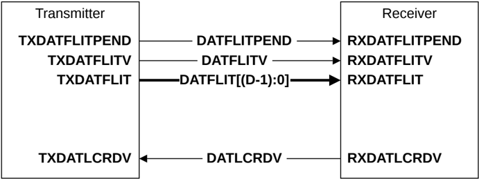

Figure B13.14: DAT channel interface pins

Table B13.5 shows the DAT channel interface signals.

Table B13.5: DAT channel interface signals

| Signal           | Description                                                                                                                                    |
|------------------|------------------------------------------------------------------------------------------------------------------------------------------------|
| DATFLITPEND      | Data Flit Pending. Early indication that a data flit could be transmitted in the following cycle. See B14.4 Flit level clock gating.           |
| DATFLITV         | Data Flit Valid. The transmitter sets this signal HIGH to indicate when DATFLIT[(D-1):0] is valid.                                             |
| DATFLIT[(D-1):0] | Data Flit. See B13.9.4 Data flit for a description of the data flit format.                                                                    |
| DATLCRDV         | Data L-Credit Valid. The receiver sets this signal HIGH to return a data channel L-Credit to a transmitter. See B14.2.1 L-Credit flow control. |