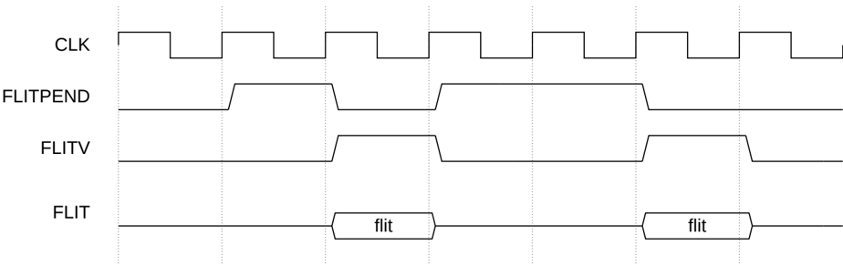

## B14.4 Flit level clock gating

The **FLITPEND** signal associated with a channel is used to indicate if a valid flit is going to be sent in the next clock cycle. There is one **FLITPEND** signal for each channel. See B13.8 Channel interface signals for the **FLITPEND** signal naming for each channel.

The requirements for the use of **FLITPEND** are:

- It is required that the signal is asserted exactly one cycle before a flit is sent from the Transmitter.
- When asserted, it is permitted, but not required, that the Transmitter sends a flit in the next cycle.
- When deasserted, it is required that the Transmitter does not send a flit in the next cycle.
- A Transmitter is permitted, but not required, to keep the signal permanently asserted. For example, if a Transmitter cannot determine in advance when a flit is to be sent.
- A Transmitter is permitted, but not required, to assert this signal without possessing an L-Credit.
- A Transmitter is permitted, but not required, to assert and subsequently deassert this signal without sending a flit.

Figure B14.1 shows an example of the use of the **FLITPEND** signal.

Figure B14.1: **FLITPEND** indicating a valid flit in next cycle

