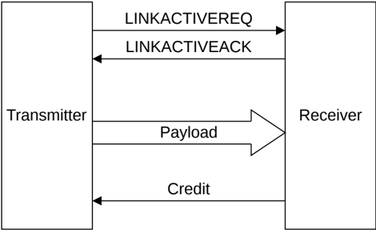

## B14.5 Interface activation and deactivation

A mechanism is provided for an entire interface to move between a full running operational state and a low power state. It is important to exchange L-Credits when moving between operational states, including when exiting from reset. The exchange of Link flits is carefully controlled to avoid the loss of flits or credits.

On exit from reset, or when moving to a full running operational state, the interface starts in an idle state and the transfer of flits can only commence when L-Credits have been exchanged. L-Credits can only be exchanged when the Sender of the credits knows the Receiver is ready to receive them.

A two-signal, four-phase, handshake mechanism is used. This two signal interface is used for all channels traveling in the same direction, rather than being required for each individual channel. An entire interface uses a total of four signals, two signals are used for all the transmit channels and two signals are used for all the receive channels.

### B14.5.1 Request and Acknowledge handshake

For the purposes of description, the two signal Request and Acknowledge signaling is described using the signal names **LINKACTIVEREQ** and **LINKACTIVEACK**.

This section describes the operation of the **LINKACTIVEREQ** and **LINKACTIVEACK** handshake pairs for all channels moving in one direction. B14.6 Transmit and receive link interaction describes the interaction between the handshake pairs for the transmit channels and those for the receive channels.

For a single channel, or group of channels traveling in the same direction, Figure B14.2 shows the relationship between the Payload, Credit, **LINKACTIVEREQ**, and **LINKACTIVEACK** signals.

Figure B14.2: Relationship between Payload, Credit, and LINKACTIVE signals

As Figure B14.2 shows, the Transmitter, which sends the payload flits, requires a credit before a flit is sent. A credit is passed from the Receiver when resources are available to accept a flit:

- On exit from reset, credits are held by the Receiver and must be passed to the Transmitter before flit transfer can begin.
- During normal operation, there is an ongoing exchange of flits and credits between the two sides of the interface.
- Before entering a low power state, the sending of payload flits must be stopped and all credits must be returned to the Receiver. This effectively returns the interface to the same state previously immediately after reset.

Four states are defined for the interface operation:

**RUN** There is an ongoing exchange of flits and credits between the two components.