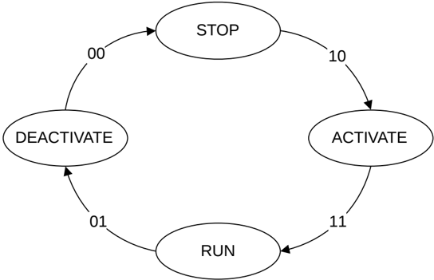

**STOP** The interface is in a low power state and is not operational. All credits are held by the Receiver and the Transmitter is not permitted to send any flits.

**ACTIVATE** This state is used when moving from the STOP state to the RUN state.

**DEACTIVATE** This state is used when moving from the RUN state to the STOP state.

RUN and STOP are stable states. When one of these states is entered, a channel can remain in this state for an indefinite period.

DEACTIVATE and ACTIVATE are transient states. It is expected that when one of these states is entered, a channel moves to the next stable state in a relatively short period.

> **_NOTE:_** The specification does not define a maximum period in a transient state, but it is expected that for any given implementation it is deterministic.

The state is determined by the **LINKACTIVEREQ** and **LINKACTIVEACK** signals. Figure B14.3 shows the relationship between the four states.

Figure B14.3: Request and Acknowledge handshake states

Table B14.1 shows the mapping of the states to the LINKACTIVEREQ and LINKACTIVEACK signals.

Table B14.1: Mapping of states to the LINKACTIVE signals

| State      | LINKACTIVEREQ | LINKACTIVEACK |
|------------|---------------|---------------|
| STOP       | 0             | 0             |
| ACTIVATE   | 1             | 0             |
| RUN        | 1             | 1             |
| DEACTIVATE | 0             | 1             |

Table B14.2 describes the behavior of both the Transmitter and the Receiver of a single link for each of the four states.