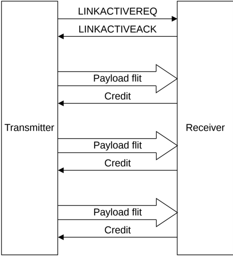

Figure B14.4: Example of a multiple channel unidirectional interface

The rules regarding the relationship between the LINKACTIVEREQ and LINKACTIVEACK signals must be applied appropriately across all channels:

- When a state change requires the Transmitter to be able to accept credits, the Transmitter must be able to accept credits on all channels.
- When a state change requires the Receiver to be able to accept flits, the Receiver must be able to accept credits on all channels.
- When the sending of flits must stop before a state change, the sending of flits must stop on all channels.
- When the sending of credits must stop before a state change, the sending of credits must stop on all channels.
- A credit can only be associated with a flit on the same channel.