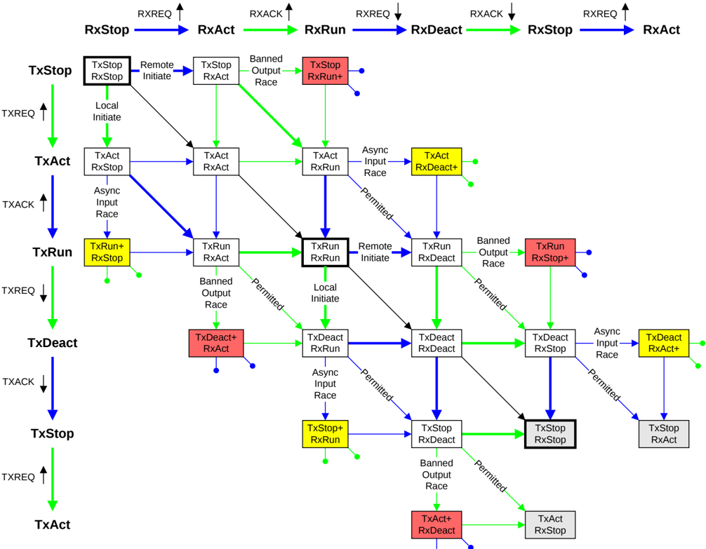

Figure B14.5: Combined Tx and Rx state machines

Figure B14.5 shows the combined Tx and Rx state machines for a single component:

- For clarity, shortened state names and signal names are used.
- A green arrow represents a transition that the local agent can control.
- A blue arrow represents a transition that is under the control of the remote agent on the other side of the interface.
- A black arrow represents a transition that is made when both the local and remote agents make a transition at the same time.
- Around the edge of Figure B14.5 is an indication of the individual Tx and Rx states. The green and blue arrows show which agent controls the transition. There is also an indication of the signal change that causes the state transition.
- A vertical or horizontal arrow is a state change caused by just one signal change, that is, only the Rx state machine or the Tx state machine changes state, not both.
- A diagonal arrow is a state change caused by two signals changing at the same time. If the diagonal arrow is green or blue, the same agent is changing both signals.