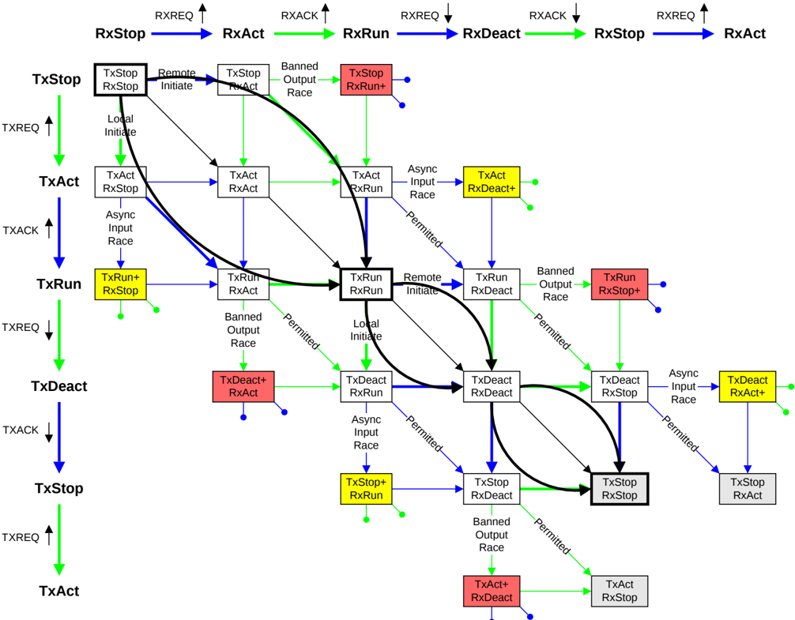

Figure B14.6: Expected Tx and Rx state machines transitions

Figure B14.6 shows, using bold arrows, the routes between the stable TxStop/RxStop and TxRun/RxRun states, and between the stable TxRun/RxRun and the TxStop/RxStop states.

The difference between the two routes moving from TxStop/RxStop to TxRun/RxRun states compared to moving from TxRun/RxRun to TxStop/RxStop states is due to the requirement to return L-Credits in the latter case. The differences are detailed in the following sections.

#### B14.6.3.1 Expected transitions from TxStop/RxStop to TxRun/RxRun

There are two expected routes from a stable Stop/Stop to Run/Run state.

Table B14.4 shows, in terms of the state transitions, the two expected paths.

Table B14.4: Stop/Stop to Run/Run state paths

| Route  | State 1       | State 2      | State 3     | State 4     |
|--------|---------------|--------------|-------------|-------------|
| Path 1 | TxStop/RxStop | TxStop/RxAct | TxAct/RxRun | TxRun/RxRun |

Continued on next page