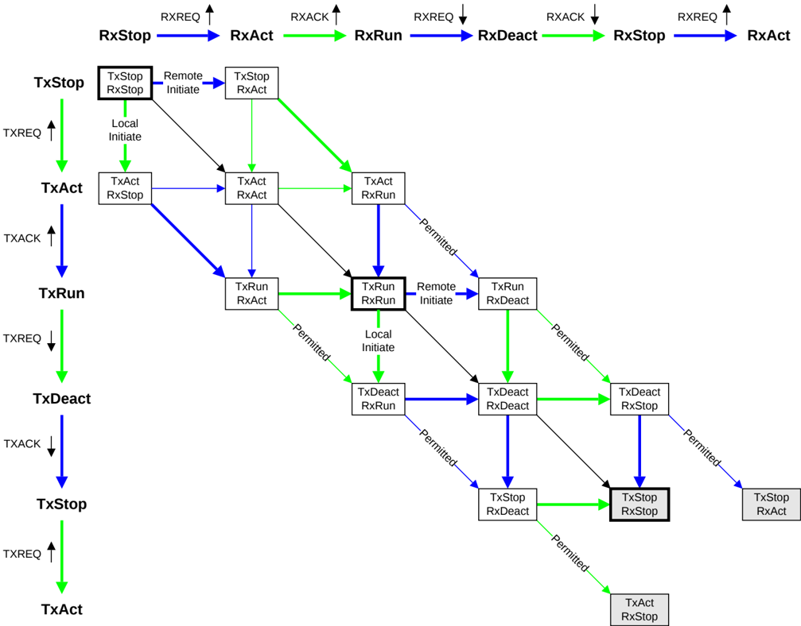

For all input race conditions, a component that observes the input race is required to wait for both signals before changing any output signals. This is represented in Figure B14.5 by the fact that the only permitted output transition from a race state is caused by the arrival of the other signal associated with the race condition.

#### B14.6.3.5 Combined Tx and Rx state machines without race conditions

In Figure 14-7, all transitions and states that occur as a result of a race condition in the combined Tx and Rx state machines have been removed.

Figure B14.7: Combined Tx and Rx state machines without race conditions

