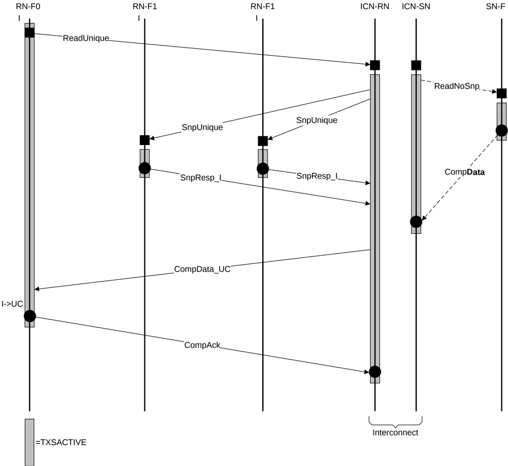

Figure B14.8 shows the requirements for TXSACTIVE assertion during the life of a transaction.

Figure B14.8: TXSACTIVE assertion during the life of a transaction

#### B14.7.2.1 TXSACTIVE signaling from a Request Node

When initiating new transactions, a Request Node must assert **TXSACTIVE** in the same cycle or before **TXREQFLITV** is asserted and must keep **TXSACTIVE** asserted until after the final completing flit of a transaction is sent or received.

The type of flit that completes a transaction initiated by a Request Node depends on both the transaction type and the manner in which the transaction progresses. For example, a ReadNoSnp transaction could typically complete with the receipt of the last CompData flit, but could equally complete with a ReadReceipt, if this is later than the last CompData flit.

An RN-F or RN-D component must also assert **TXSACTIVE** while a Snoop transaction is in progress.