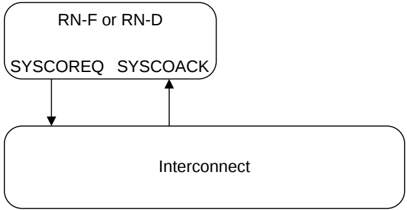

## B15.1 Overview

The system coherency interface signals are:

**SYSCOREQ** Requester coherency request.

**SYSCOACK** Interconnect coherency acknowledge.

Both **SYSCOREQ** and **SYSCOACK** signals must be synchronous to CLK and therefore are not required to be synchronized. If they cross a clock domain, the clock domain crossing bridge is required to synchronize the signals.

Figure B15.1 shows the system coherency interface signals connections.

Figure B15.1: System coherency interface signals

> **_NOTE:_** In this chapter:
>
> - Coherency when stated, includes the DVM domain, unless explicitly stated otherwise.
> - Snoop when stated, includes SnpDVMOp, unless explicitly stated otherwise.