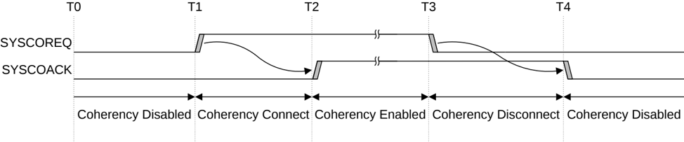

## B15.2 Handshake

A Request Node, an RN-F or an RN-D, requests connection to system coherency by setting **SYSCOREQ** HIGH. The interconnect indicates that coherency is enabled by setting **SYSCOACK** HIGH.

The Request Node requests disconnection from system coherency by setting **SYSCOREQ** LOW. The interconnect indicates that coherency is disabled by setting **SYSCOACK** LOW.

Requests to enter and exit coherency are always initiated by the Request Node.

Figure B15.2 shows the system coherency interface handshake timing.

Figure B15.2: System coherency interface handshake timing

As Figure B15.2 shows, the interface signaling obeys four-phase handshake rules:

- **SYSCOREQ** can only change when **SYSCOACK** is at the same logic state.
- **SYSCOACK** can only change when **SYSCOREQ** is at the opposite logic state.

### B15.2.1 Request Node rules

Referring to Figure B15.2, a Request Node must:

- Be able to service Snoop requests when **SYSCOREQ** is HIGH at T1.
- Not issue a transaction that permits a coherent location to be cached until **SYSCOACK** is HIGH at T2.
- Ensure all transactions that permit a coherent location to be cached are complete before **SYSCOREQ** is LOW at T3.
- **SYSCOREQ** can only be deasserted on the cycle after all of the following:

    - All data packets are received for:

        - ReadUnique
        - ReadPreferUnique
        - ReadClean
        - ReadNotSharedDirty
        - ReadShared
        - MakeReadUnique that completes with a data transfer

    - Comp is received for:

        - CleanUnique
        - MakeUnique
        - MakeReadUnique that completes without a data transfer

    - All data packets are sent for a CopyBack transaction that completes with a data transfer.
    - CompAck is sent for a CopyBack transcation that completes without a data transfer.