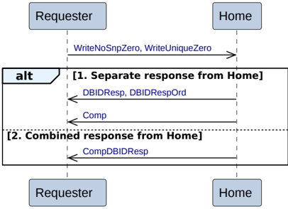

#### B2.3.2.2 Write Zero

Figure B2.4 shows the possible transaction flows for a Write Zero transaction.

Figure B2.4: Write Zero

- The transaction starts with the Requester issuing a Write Zero request to the Home. The Write Zero transactions are:

    - WriteUniqueZero
    - WriteNoSnpZero

- The Home has two alternatives to send the completion response and the data request response to the Requester.

    1. Separate response from Home

        - The Home returns a data request response, DBIDResp or DBIDRespOrd, to the Requester.
        - The Home returns a completion response, Comp, to the Requester.

    2. Combined response from Home

        - The Home returns a combined data request and completion response, CompDBIDResp, to the Requester.

#### B2.3.2.3 CopyBack Write

Figure B2.5 shows the possible transaction flows for a CopyBack Write transaction.