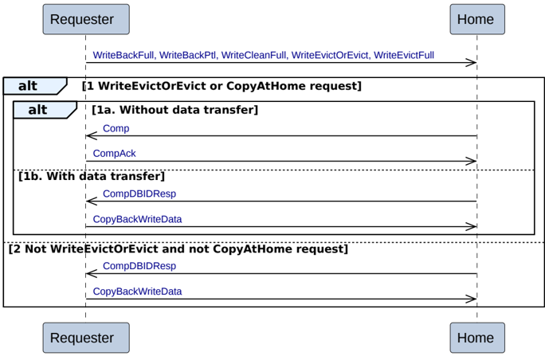

Figure B2.5: CopyBack Write

The sequence for CopyBack Write is:

- The transaction starts with the Requester issuing a CopyBack Write request to the Home. The CopyBack Write transactions are:

    - WriteBackPtl
    - WriteBackFull
    - WriteCleanFull
    - WriteEvictFull
    - WriteEvictOrEvict

    The request contains the following fields which affect the transaction flow:

    - CAH
    - Opcode

- The Home can choose to complete the transaction with a Comp or CompDBIDResp response. The choice of response from the Home is determined by the request type and CAH value. The combinations are described in alternatives 1-2:

    1. **WriteEvictOrEvict or CopyAtHome request**

        The request is WriteEvictOrEvict or the CAH bit value in the request is set to 1.

        The Home has two alternative responses to return to the Requester:

        - **Alt 1a. Without data transfer**

            - The Home returns a completion response, Comp, to the Requester to avoid the data transfer.
            - The Requester sends a completion acknowledge, CompAck. The Requester must send this regardless of the ExpCompAck value in the original request and only after receiving the Comp response.

        - **Alt 1b. With data transfer**

            - The Home returns a combined data request and completion response, CompDBIDResp, to the Requester.