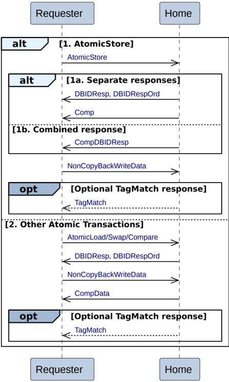

Figure B2.9: Atomic transactions

There are two possible sequences for the Atomic transactions.

The Requester alternatives are:

1. **AtomicStore**

    For an AtomicStore transaction:

    - The Requester sends an AtomicStore request to the Home.
    - The Home has two alternatives to send the completion response and the data request response to the Requester.

        - **Alt 1a. Separate responses**

            The Home does both the following:

            - Returns a data request, DBIDResp or DBIDRespOrd, to the Requester.
            - Returns a completion response, Comp, to the Requester. It is permitted, but not required, to wait for write data before returning Comp.

        - **Alt 1b. Combined response**

            The Home returns a combined data request and completion response, CompDBIDResp, to the Requester.