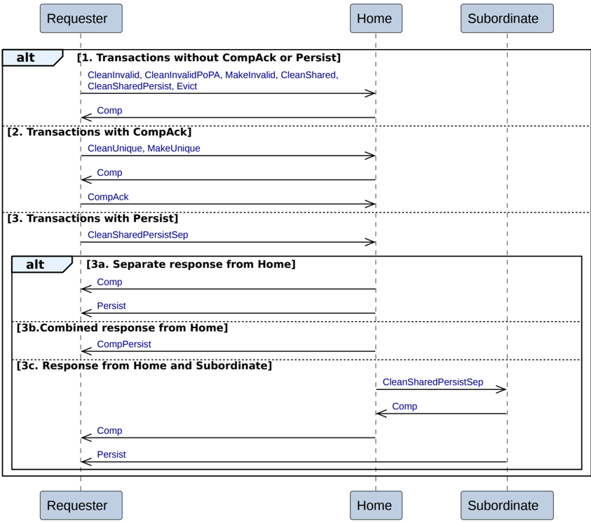

Figure B2.11: Dataless transactions

There are three possible sequences for Dataless transactions.

1. **Transactions without CompAck or Persist**

    The Dataless transactions without CompAck or Persist are:

    - CleanInvalid
    - CleanInvalidPoPA
    - MakeInvalid
    - CleanShared
    - CleanSharedPersist
    - Evict

    The Requester sends the request to the Home.

    The Home returns a completion response, Comp, to the Requester.

2. **Transactions with CompAck**

    The Dataless transactions with CompAck are:

    - CleanUnique
    - MakeUnique