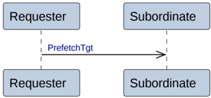

    The Requester sends the request to the Home.

    The Home returns a completion response, Comp, to the Requester.

    The Requester sends a completion acknowledge, CompAck, to the Home.

    The Requester must only send this after receiving Comp.

3. **Transactions with Persist**

    The Dataless transaction with Persist is:

    - CleanSharedPersistSep

    The Requester sends the request to the Home.

    The Home has three alternatives to complete the transaction.

    - **Alt 3a. Separate responses from the Home**

        The Home does both the following:

        - Returns a completion response, Comp, to the Requester.
        - Returns a persist response, Persist, to the Requester.

    - **Alt 3b. Combined response from Home**

        The Home returns a combined completion and persist response, CompPersist, to the Requester.

    - **Alt 3c. Response from Home and Subordinate**

        With the Persist response from the Subordinate, the following happens:

        - The Home sends a downstream request, CleanSharedPersistSep, to the Subordinate.
        - The Subordinate returns a completion response, Comp, to the Home.
        - The Home returns a completion response, Comp, to the Requester. If there is an observer downstream of the Home, the Home must wait for the Comp response from the Subordinate before returning the Comp response to the Requester.
        - The Subordinate returns a persist response, Persist, to the Requester.

### B2.3.6 Prefetch transactions

Figure B2.12 shows the transaction flow for a Prefetch transaction.

Figure B2.12: Prefetch transactions

The sequence for the Prefetch transaction is:

- The Requester sends a PrefetchTgt request directly to the Subordinate.

> **_NOTE:_** No response is given.