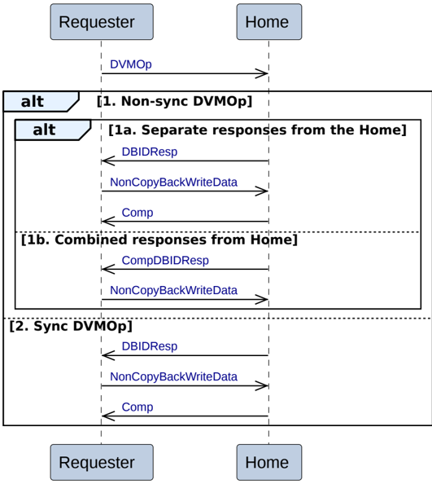

### B2.3.7 DVM transactions

Figure B2.13 shows the transaction flows for a DVM transaction.

Figure B2.13: DVM transactions

Snoop requests that are generated to complete a DVM transaction are considered as independent transactions from the Home and are not shown in this flow. See B2.3.9.8 Home to Snoopee DVM transactions for more details.

The sequence for the DVM transaction is:

- The transaction starts with the Requester issuing a DVMOp request to the Home.
- The Home has two alternatives to send the completion response and the data request response to the Requester:

1. **Non-sync DVMOp**

    - **Alt 1a. Separate responses from the Home**

        The Home does both the following:

        - Returns a data request, DBIDResp, to the Requester.
        - The Requester sends write data, NonCopyBackWriteData, to the Home. The Requester must only send this after receiving DBIDResp
        -  Returns a completion response, Comp, to the Requester. It is permitted, but not required, to wait for write data before returning Comp.

    - **Alt 1b. Combined response from the Home**

        - The Home returns a combined data request and completion response, CompDBIDResp, to the Requester.