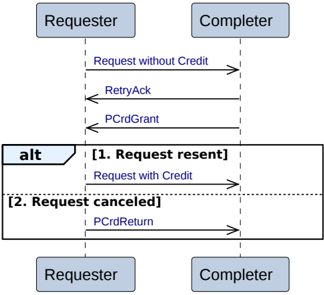

        - The Requester sends write data, NonCopyBackWriteData, to the Home.

            The Requester must only send this after receiving CompDBIDResp.

2. **Sync DVMOp**

    The Home must return separate responses.

    - The Home returns a data request, DBIDResp, to the Requester.
    - The Requester sends write data, NonCopyBackWriteData, to the Home. The Requester must only send this after receiving DBIDResp.
    - The Home returns a completion response, Comp, to the Requester. The Home must only return this after receiving write data.

### B2.3.8 Retry

Figure B2.14 shows the possible transaction flows for a Retry sequence.

Figure B2.14: Retry transactions

A request transaction is first sent without a Protocol Credit (P-Credit). If the transaction cannot be accepted at the Completer, a RetryAck response is given indicating that the transaction is not accepted and can be sent again when an appropriate credit is provided. The transaction includes a credit when it is sent a second time, and is guaranteed to be accepted.

The sequence for the Retry transaction is:

- The Requester issues a request without credit.
- The Completer returns a retry response, RetryAck, to the Requester.
- The Completer returns a protocol credit grant, PCrdGrant, to the Requester. Typically the protocol credit grant is returned a significant time after the Retry response. However, in an atypical case, the PCrdGrant response can be returned before the Retry response.
- The Requester has two alternatives to conclude the Retry sequence. This step must only occur after the Requester has received both RetryAck and PCrdGrant.

    1. **Resend the original request**

        The Requester issues a request with credit.

    2. **Cancel the request and return the credit**

        The Requester sends a protocol credit return, PCrdReturn, to the Completer.