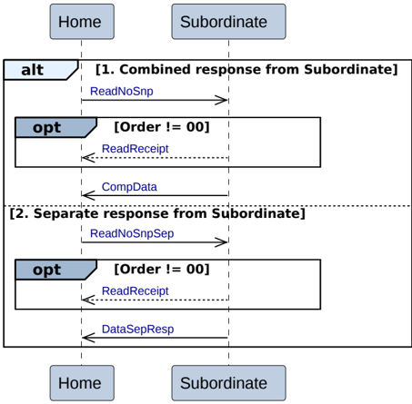

### B2.3.9 Home Initiated transactions

The Home Initiated transactions are:

- B2.3.9.1 Home to Subordinate Read transactions
- B2.3.9.2 Home to Subordinate Write transactions
- B2.3.9.3 Home to Subordinate Write Zero transactions
- B2.3.9.4 Home to Subordinate Combined Write and CMO transactions
- B2.3.9.5 Home to Subordinate Dataless transactions
- B2.3.9.6 Home to Subordinate Atomic transactions
- B2.3.9.7 Home to Snoopee transactions
- B2.3.9.8 Home to Snoopee DVM transactions

#### B2.3.9.1 Home to Subordinate Read transactions

Figure B2.15 shows the possible transaction flows for a Home to Subordinate Read transaction.

Figure B2.15: Home to Subordinate Read transactions

There are two possible sequences for Home Read transactions.

1. **Combined response from Subordinate**

    - For a ReadNoSnp transaction, the Home issues the request to the Subordinate.
    - Optionally, when the request has Order set to non-zero the Subordinate returns a ReadReceipt response.
    - The Subordinate returns a combined completion response and read data, CompData, to the Home.

2. **Separate responses from Subordinate**

    - For a ReadNoSnpSep transaction, the Home issues the request to the Subordinate.
    - Optionally, when the request has Order set to non-zero, the Subordinate returns a ReadReceipt response.
    - The Subordinate returns read data, DataSepResp, to the Home.