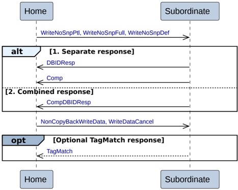

#### B2.3.9.2 Home to Subordinate Write transactions

Figure B2.16 shows the possible transaction flows for a Home to Subordinate Write transaction.

Figure B2.16: Home to Subordinate Write transactions

The sequence for the Home to Subordinate Write transaction is:

- The transaction starts with the Home issuing a WriteNoSnpPtl, WriteNoSnpFull, or WriteNoSnpDef request to the Subordinate.
- The Subordinate has two alternatives to return the completion response and the data request response to the Home.

    1. **Separate response**

        The Subordinate does both the following:

        - Returns a Data request response, DBIDResp, to the Home.
        - Returns a completion response, Comp, to the Home. It is permitted, but not required, to wait for write data, NonCopyBackWriteData, or a cancellation, WriteDataCancel, before returning Comp.

    2. **Combined response**

        The Subordinate returns a combined data request and completion response, CompDBIDResp, to the Home.

- The Home sends write data, NonCopyBackWriteData, or a cancellation, WriteDataCancel, to the Subordinate. The Home must only send this after receiving DBIDResp or CompDBIDResp.
- Optionally, when the request requires a TagMatch response, the Subordinate returns a Tag match response, TagMatch, to the Home. It is permitted, but not required, to wait for write data before returning TagMatch.

#### B2.3.9.3 Home to Subordinate Write Zero transactions

Figure B2.17 shows the possible transaction flows for a Home to Subordinate Write Zero transaction.