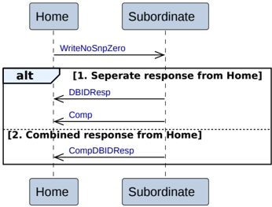

Figure B2.17: Home to Subordinate Write Zero transactions

The sequence for Write Zero is:

- The transaction starts with the Home issuing a Write Zero request to the Subordinate. The Write Zero transaction is:

    - WriteNoSnpZero

- The Subordinate has two alternatives to return the completion response and data request response to the Home.

    1. **Separate response from Home**

        The Subordinate does both the following:

        - Returns a data request response, DBIDResp, to the Home.
        - Returns a completion response, Comp, to the Home.

    2. **Combined response from Home**

        The Subordinate returns a combined data request and completion response, CompDBIDResp, to the Home.

#### B2.3.9.4 Home to Subordinate Combined Write and CMO transactions

Figure B2.18 shows the possible transaction flows for a Home to Subordinate Combined Write and CMO transaction.