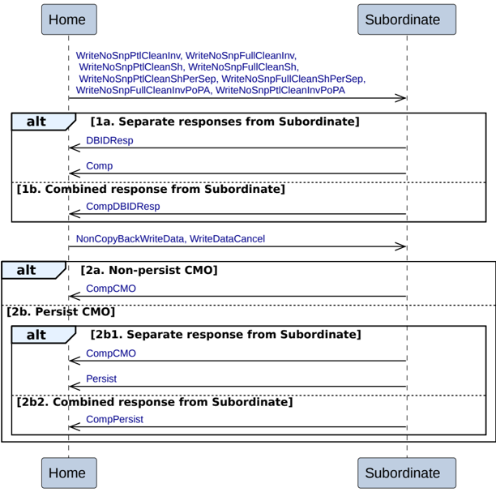

Figure B2.18: Home to Subordinate Combined Write and CMO transactions

The sequence for the Home to Subordinate Combined Write with CMO transaction is:

- The transaction starts with the Home issuing a Combined Write and CMO request to the Subordinate. The Home Combined Write and CMO transactions are:

    - WriteNoSnpPtlCleanInv
    - WriteNoSnpFullCleanInv
    - WriteNoSnpPtlCleanSh
    - WriteNoSnpFullCleanSh
    - WriteNoSnpPtlCleanShPerSep
    - WriteNoSnpFullCleanShPerSep
    - WriteNoSnpFullCleanInvPoPA
    - WriteNoSnpPtlCleanInvPoPA

- The Subordinate has two alternatives to send the completion response and the data request response to the Home.

    - **Alt 1a. Separate responses from Subordinate**

        The Subordinate does both the following:

        - Returns a data request, DBIDResp, to the Home.
        - Returns a completion response, Comp, to the Home.

            It is permitted, but not required, to wait for write data, NonCopyBackWriteData, or a cancellation, WriteDataCancel, before returning Comp.

    - **Alt 1b. Combined response from Subordinate**

        The Subordinate returns a combined data request and completion response, CompDBIDResp, to the Home.