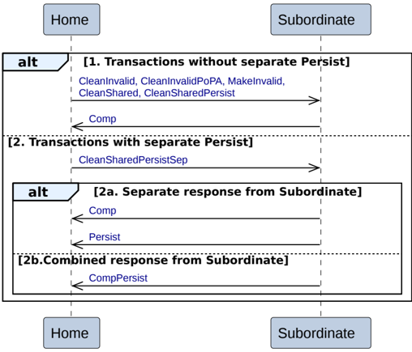

- The Home sends write data, NonCopyBackWriteData, or a cancellation, WriteDataCancel, to the Subordinate. The Home must only send this after receiving DBIDResp or CompDBIDResp.

- There are two alternatives for the Subordinate to return the CMO response depending on whether or not a persist response, Persist, is required. It is permitted, but not required, for the Subordinate to wait for write data before returning CompCMO, Persist, or CompPersist.

    - **Alt 2a. Non-persist CMO**

        When a persist response is not required, the Subordinate returns a CMO completion response, CompCMO, to the Home.

    - **Alt 2b. Persist CMO**

        When a persist response is required, the Subordinate has two alternatives to send the CMO completion response and persist response.

        - **Alt 2b1. Separate response from Subordinate**

            The Subordinate does both the following:

            - Returns a CMO completion response, CompCMO, to the Home.
            - Returns a persist response, Persist, to the Home.

        - **Alt 2b2. Combined response from Subordinate**

            The Subordinate returns a combined CMO completion response and persist response, CompPersist, to the Home.

#### B2.3.9.5 Home to Subordinate Dataless transactions

Figure B2.19 shows the transaction flows for a Home to Subordinate Dataless transaction.

Figure B2.19: Home to Subordinate Dataless transactions

There are two possible sequences for Home to Subordinate Dataless transactions.

1. **Transactions without separate Persist**

    The Home to Subordinate Dataless transactions without separate Persist are:

    - CleanInvalid
    - CleanInvalidPoPA