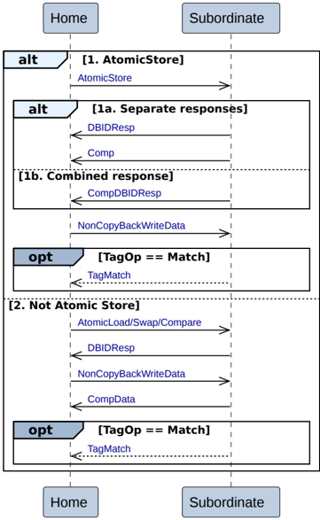

    - MakeInvalid
    - CleanShared
    - CleanSharedPersist

    The Home sends the request to the Subordinate.

    The Subordinate returns a completion response, Comp, to the Requester.

2. **Transactions with separate Persist**

    The Home to Subordinate Dataless transaction with separate Persist is:

    - CleanSharedPersistSep

    The Home sends the request to the Subordinate.

    The Subordinate has two alternatives to complete the transaction.

    - **Alt 2a. Separate response from Subordinate**

        The Subordinate does both the following:

        - Returns a completion response, Comp, to the Home.
        - Returns a persist response, Persist, to the Home.

            Use of separate completion response, Comp, and persist response, Persist, allows a Completer to send an early Comp without waiting for Persist. Typically, Persist takes much longer.

    - **Alt 2b. Combined response from Subordinate**

        The Subordinate returns a combined completion and persist response, CompPersist, to the Home.

#### B2.3.9.6 Home to Subordinate Atomic transactions

Figure B2.20 shows the possible transaction flows for Home to Subordinate Atomic transactions.

Figure B2.20: Home to Subordinate Atomic transactions

