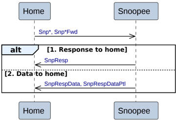

There are two alternatives for the Home Atomic transactions.

When the Subordinate supports the execution of atomic operations, the Home is permitted, but not required, to forward Atomic transactions to the Subordinate.

1. **AtomicStore**

    - The Home sends an AtomicStore request to the Subordinate.
    - The Subordinate has two alternatives to send the completion response and data request response to the Home.

    - **Alt 1a. Separate responses**

        The Subordinate does both the following:

        - Returns a data request, DBIDResp, to the Home.
        - Returns a completion response, Comp, to the Home.

            It is permitted, but not required, to wait for write data before returning Comp.

    - **Alt 1b. Combined response**

        The Subordinate returns a combined data request and completion response, CompDBIDResp, to the Home.

    - The Home sends write data, NonCopyBackWriteData, to the Subordinate. The Home must only send this after receiving DBIDResp or CompDBIDResp. The Home must not wait for Comp before sending write data.
    - Optionally, when the request requires a tag match response, the Subordinate returns a TagMatch response to the Home. It is permitted, but not required, to wait for write data before returning TagMatch.

2. **Not AtomicStore**

    - The Home sends an AtomicLoad, AtomicSwap, or AtomicCompare request to the Subordinate.
    - The Subordinate sends a data request response, DBIDResp, to the Home.
    - The Home sends write data, NonCopyBackWriteData, to the Subordinate. The Home must only send this after receiving DBIDResp. The Home must not wait to receive CompData before write data is sent.
    - The Subordinate returns a combined data and completion response, CompData, to the Home. It is permitted, but not required, to wait for write data before returning CompData.
    - Optionally, when the request requires a TagMatch response, the Subordinate returns a tag match response, TagMatch, to the Home. It is permitted, but not required, to wait for write data before returning TagMatch.

#### B2.3.9.7 Home to Snoopee transactions

Figure B2.21 shows the possible transaction flows for a Home to Snoopee transaction.

Figure B2.21: Home to Snoopee transactions

The following transactions must use this transaction flow.