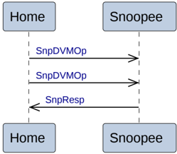

- SnpOnce
- SnpClean
- SnpNotSharedDirty
- SnpShared
- SnpUnique
- SnpPreferUnique
- SnpCleanShared
- SnpCleanInvalid
- SnpMakeInvalid
- SnpQuery

The following transactions are also permitted, but not required, to use this transaction flow.

- SnpOnceFwd
- SnpCleanFwd
- SnpNotSharedDirtyFwd
- SnpSharedFwd
- SnpUniqueFwd
- SnpPreferUniqueFwd

The sequence the Home to Snoopee transaction is:

- The transaction starts with the Home issuing a Snoop request to the Snoopee.
- The Snoopee has two alternatives to complete the transaction:

    1. The Snoopee provides a snoop response, SnpResp, to the Home. This is the only permitted alternative for a SnpMakeInvalid transaction.
    2. The Snoopee provides a snoop response with data, SnpRespData or SnpRespDataPtl.

#### B2.3.9.8 Home to Snoopee DVM transactions

Figure B2.22 shows the transaction flow for a Home to Snoopee DVM transaction, SnpDVMOp.

Figure B2.22: Home to Snoopee DVM transactions

The sequence for the Home to Snoopee DVM transaction is:

- The Home issues two Snoop DVM requests, SnpDVMOp, to the Snoopee.
- The Snoopee provides a single Snoop response, SnpResp. The Snoopee must only provide the Snoop response after receiving both Snoop DVM requests.